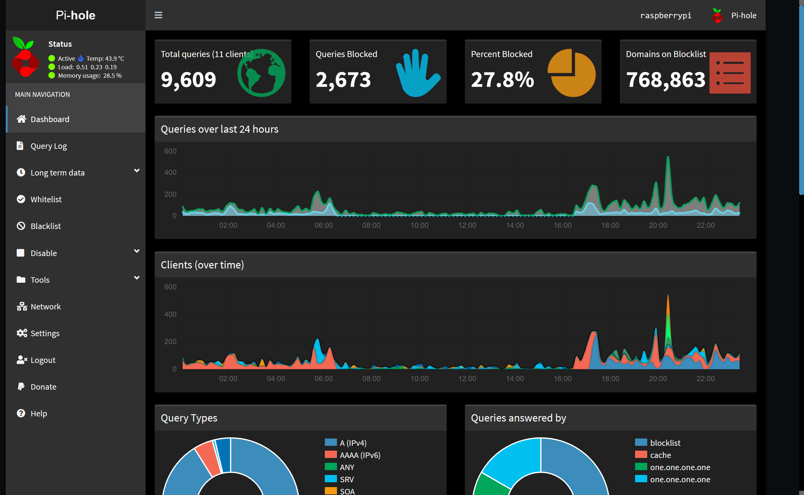

# pi-hole-material-dark
Custom dark theme CSS for pi-hole to replace skin-blue AdminLTE theme.

Created for use with [pi-hole](https://github.com/pi-hole/pi-hole).



----------
## Install

1. open a terminal (or SSH if you're remoting in) ( <kbd>Ctrl</kbd> + <kbd>Alt</kbd> + <kbd>T</kbd> )
2. Type: `cd /var/www/html/`
3. Type: `sudo wget https://raw.githubusercontent.com/MBarrows20/pi-hole-material-dark/install_Material_Dark_Theme.sh`
4. Type: `sudo chmod +x install_Material_Dark_Theme.sh`
5. Type: `sudo ./install_Material_Dark_Theme.sh`
6. Follow the onscreen instructions!

----------
## Uninstall/Revert
Type the following commands into SSH, line by line.

```
cd /var/www/html/admin
sudo git reset --hard
```

----------
### License
This project is licensed under the MIT License - see the [LICENSE](LICENSE) file for details.
