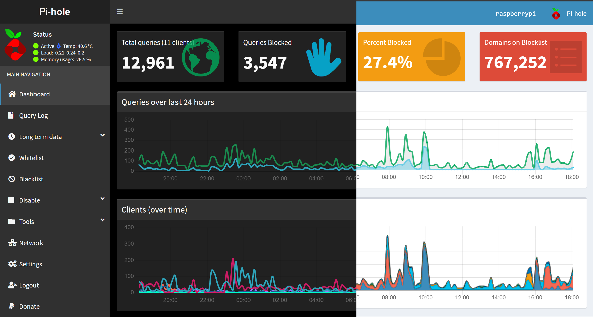

# pi-hole-material-dark
Custom dark theme CSS for pi-hole to replace skin-blue AdminLTE theme.

Created for use with [pi-hole](https://github.com/pi-hole/pi-hole).



---
## Easy install
````
1. open a terminal (or SSH if you're remoting in) ( <kbd>Ctrl</kbd> + <kbd>Alt</kbd> + <kbd>T</kbd> )
2. Type: `cd /var/www/html/`
3. Type: `sudo wget https://github.com/MBarrows20/pi-hole-material-dark/AutoInstall/install.sh`
4. Type: `sudo chmod +x install.sh`
5. Type: `sudo ./install.sh`
6. Follow the onscreen instructions!
````

## Manual Install
Type the following commands into SSH, line by line.

```
cd /var/www/html/admin/style/vendor/
sudo git clone https://github.com/MBarrows20/pi-hole-material-dark/AutoInstall.git
sudo rm -f skin-blue.min.css
sudo rm -f daterangepicker.css
sudo cp pi-hole-material-dark/skin-blue.min.css .
sudo cp pi-hole-material-dark/daterangepicker.css .
sudo rm -rf pi-hole-material-dark
```
Don't forget the trailing " ." on the cp lines (it means copy to current directory).

## Uninstall/Revert
Type the following commands into SSH, line by line.

```
cd /var/www/html/admin/style/vendor/
sudo git reset --hard
```

---

### License
This project is licensed under the MIT License - see the [LICENSE](LICENSE) file for details.
